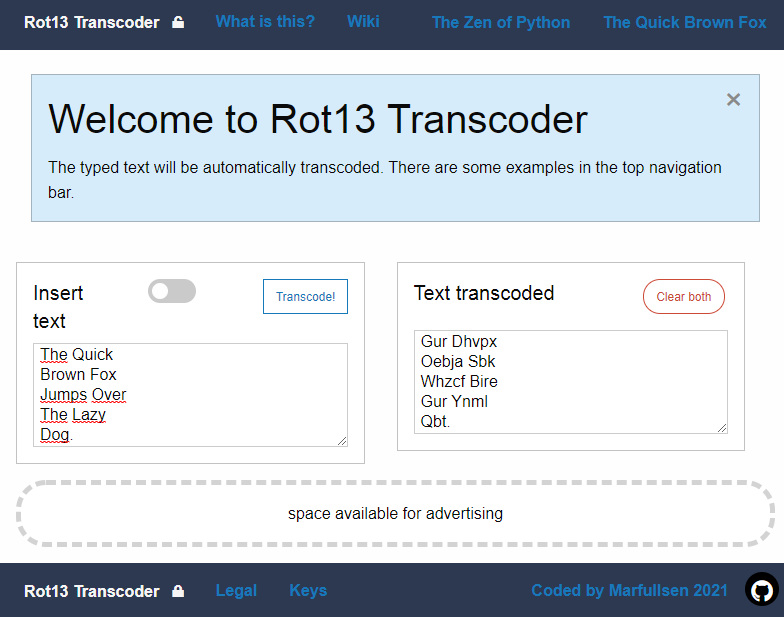

# Rot13 Transcoder
[](https://get.foundation/)
[](https://www.javascript.com/)
[](https://Marfullsen.github.io/rot13-transcoder/)

[](https://Marfullsen.github.io/rot13-transcoder/)
---

## Description

[Site](https://Marfullsen.github.io/rot13-transcoder/) for encrypting and decrypting ciphertext with [rot13](https://en.wikipedia.org/wiki/ROT13).

---

## History

ROT13 is a special case of the encryption algorithm known as a Caesar cipher, used by Julius Caesar in the 1st century BC

---

## How it works

The cipher consists of replacing each letter of the alphabet with the letter that is thirteen positions ahead, thus, each letter would be as follows:

| Input | ABCDEFGHIJKLMNOPQRSTUVWXYZabcdefghijklmnopqrstuvwxyz |
| --- | --- |
| Output | NOPQRSTUVWXYZABCDEFGHIJKLMnopqrstuvwxyzabcdefghijklm |

An example of the use of encryption would be:

__The Quick Brown Fox Jumps Over The Lazy Dog.__

>_Gur Dhvpx Oebja Sbk Whzcf Bire Gur Ynml Qbt._

---

## Usage when download the repo.
1. Install `git`.
2. Clone, enter the directory and open directly with any browser.
*Things like Live Server are optional.
``` 
git clone https://github.com/Marfullsen/rot13-transcoder.git
cd rot13-transcoder
```
3. Enjoy!

---

## Visit the page:
[Marfullsen.github.io/rot13-transcoder](https://Marfullsen.github.io/rot13-transcoder/)

---

## Credit
This website is inspired by ["The Zen of Python"](https://www.python.org/dev/peps/pep-0020/).
